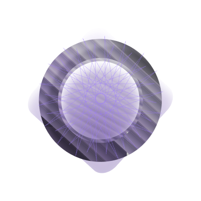

# SarthiAI

Welcome to the Sarthi AI project This program is also called the Sarthi Development Program

We are all part of this program. 

# Project Stucter

All info about project stucter is in stucter.s file.
If you want to know more about stucter then you can check out stucter.s file in this folder.
Heve you any su

# Workflow Overview:---
---------------------------------
User Interaction: The user accesses the web interface, uploads code or media, or interacts with Sarthi AI for a specific task (e.g., website generation).
Backend API: The backend manages the interaction between the various AIs (Sarthi, Yug, Aadi, Arth, Ved) and handles requests via REST APIs.
Training & Output: The training folder processes new datasets, and the outputs (websites, apps, media) are stored in the output files directory.
Collaboration of AIs: Ved recognizes faces and emotions, Aadi generates music, Arth handles video and media, and Yug generates 3D items.

------------------------------------- 
